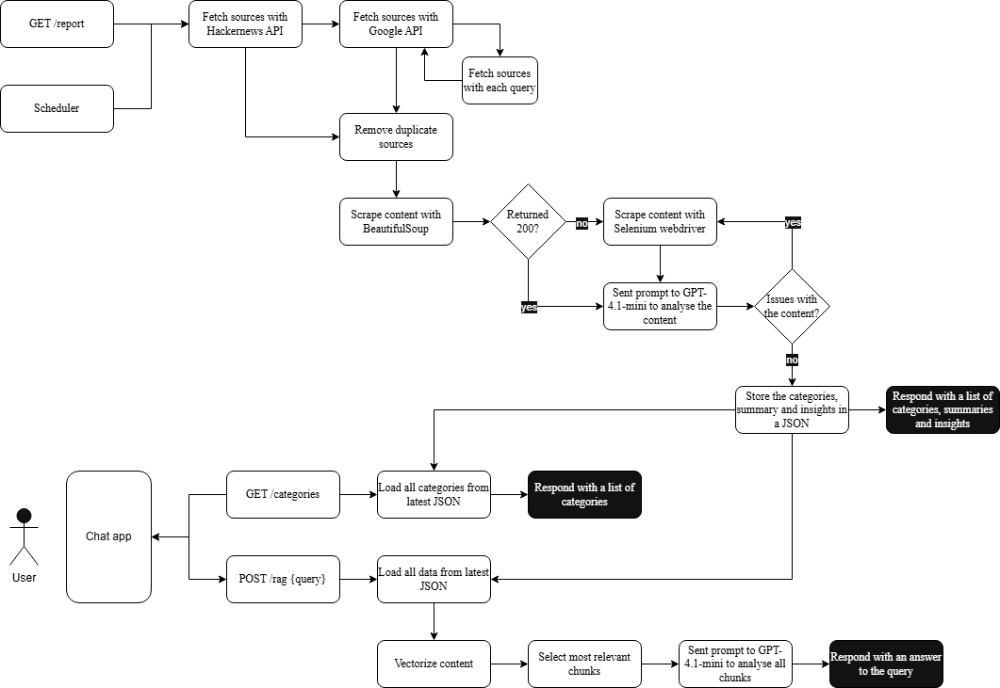

# Llm-News

## Quick setup - Backend
1. Create a venv - `python3 -m venv venv`
2. Activate the venv - `source venv/bin/activate`
3. Install the requirements - `pip install -r requirements.txt`
4. Copy .example.env to .env
5. Create OpenAI key and add to .env from https://platform.openai.com/api-keys
6. Create Google API key and add to .env from https://console.cloud.google.com/apis/credentials
7. Create search engines and add searchengine-IDs to .env from https://programmablesearchengine.google.com/controlpanel/all (see 'Creating Google search engines' for more information)
8. Run the app - `uvicorn main:app --reload`

## Quick setup - frontend
1. cd `frontend`
2. `npm install`
3. `npm run dev`

## Collecting sources
LLM-News collects sources (URLs) by using the Hacker News & Google API. The Hacker News API returns a list of websites uploaded and upvoted by its comprehensive userbase. On the other hand, the Google API allows for a more dynamic approach in which a search string can be defined to find sources on your own terms. Keep in mind that a Google search string must be delicately balanced to reduce noise to a minimum.

### Creating Google search engines
Step 7 in the setup mentions the searchengine-ID. This id is a reference to the 'Programmable Search Engine' from Google. The programmable search engine can be used to define websites to use as filter in the search query. It is advised to use only one endpoint from a website per programmable search engine, for example, https://website.com/en/articles/artificial-intelligence/*. These endpoints can be added under the category 'Sites to search'. This is necessary, because the Google API only allows us to retrieve a maximum of 100 results per search engine. To get the best results it might be necessary to enhance the search query, which can be done by changing the search string in the request, for example.

### Testing Google search engines
It is advised to test if the search query does not obtain more than 100 results weekly and does also not contain too much noise. Use the parameters from the function 'fetch_news_page' in 'google_api_service.py' and the search engine id to test the search engine. You can test the search engine on the following page: https://developers.google.com/custom-search/v1/reference/rest/v1/cse/list?apix=true

## Scraping sources
The Hacker News API and Google API only return the title and the endpoint of the source. The content still has to be scraped, which is done with a two-layer method. First a combination of BeautifulSoup and Httpx scrapes the content of most simple HTML pages. If an error response is returned the second method comes into play. On the second try a combination of Selenium and Undetected Chromedriver is used to scrape more complex pages, which can be used to handle Javascript contents. For this to work it is necessary to imitate a real user, which means the use of GUI might be necessary to bypass bot detection mechanisms. On Windows there is no other option than to use GUI. However, on Ubuntu or Docker it might be possible to use xvfb to scrape, but this is neither implemented or tested.

## Interpreting with an LLM
The contents from the scraper are then in combination with a comprehensive prompt sent to the LLM. In this case the GPT-4o-mini is used because it is a perfect fit for large bodies of data due to it being a perfect fit for text interpretation and summarization and its high input capacity of 200.000 tokens. A step-by-step prompt is sent to the LLM to make sure that the response follows a strict JSON-format. Upon receiving this response the format is expected, and if the format was incorrect an error is sent to the log. Upon rejecting an article the LLM is also requested to response with a retry error, which will sent the source back to the Selenium scraper if it was not already scraped with Selenium. If the article is accepted the LLM will generate categories, a summary and insights. The LLM might also define categories that are not in the categories.json, in that case the categories are added to the csv file as missing categories. Also a warning will be logged because the missing categories need to be reviewed before adding them into the categories.json file.

## Response and UI
The response from LLM-News will contain metadata like the source and title, but also the categories, insights and a summary. This data is then stored in a JSON file within the log. Then with the use of RAG an interactive LLM can be setup by using the Vite user interface. This UI allows the user to ask questions and also filter on categories to base its questions upon.
